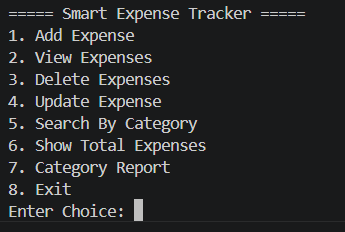
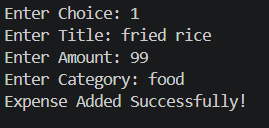
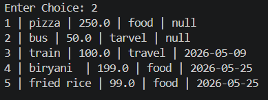
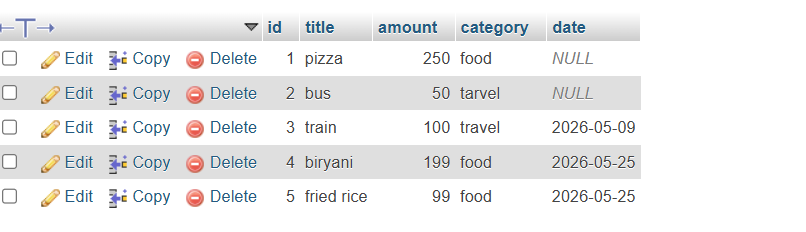

# Smart Expense Tracker

## Overview
Smart Expense Tracker is a Java-based console application developed using JDBC and MySQL.

This project helps users manage daily expenses with features like:
- Adding expenses
- Viewing expenses
- Updating expenses
- Deleting expenses
- Searching expenses by category
- Viewing total expenses
- Generating category-wise reports

The project uses MySQL database integration through JDBC for storing and managing expense records.

---

## Features

- Add Expense
- View Expenses
- Update Expense
- Delete Expense
- Search By Category
- Show Total Expenses
- Category Wise Report
- Auto Increment Expense IDs
- Automatic Date Handling
- MySQL Database Integration

---

## Technologies Used

- Java
- JDBC
- MySQL
- XAMPP
- VS Code
- Git & GitHub

---

## Project Structure

```text
smart-expense-tracker-java/
│
├── src/
├── lib/
├── screenshots/
├── README.md
├── .gitignore
```

---

## Database Setup

Create database:

```sql
CREATE DATABASE expense_tracker;
```

Create table:

```sql
CREATE TABLE expenses (
    id INT PRIMARY KEY AUTO_INCREMENT,
    title VARCHAR(100),
    amount DOUBLE,
    category VARCHAR(100),
    date DATE DEFAULT (CURRENT_DATE)
);
```

---

## How To Run

Compile project:

```bash
javac -cp "lib/*" src/*.java
```

Run project:

```bash
java -cp "lib/*;src" Main
```

---

## Screenshots

### Main Menu



### Add Expense



### View Expenses



### Database Table



---

## Future Improvements

- Monthly Expense Reports
- GUI Integration
- Expense Analytics
- User Authentication
- Export Reports

---

## Author

Uma Chandra Kiran
